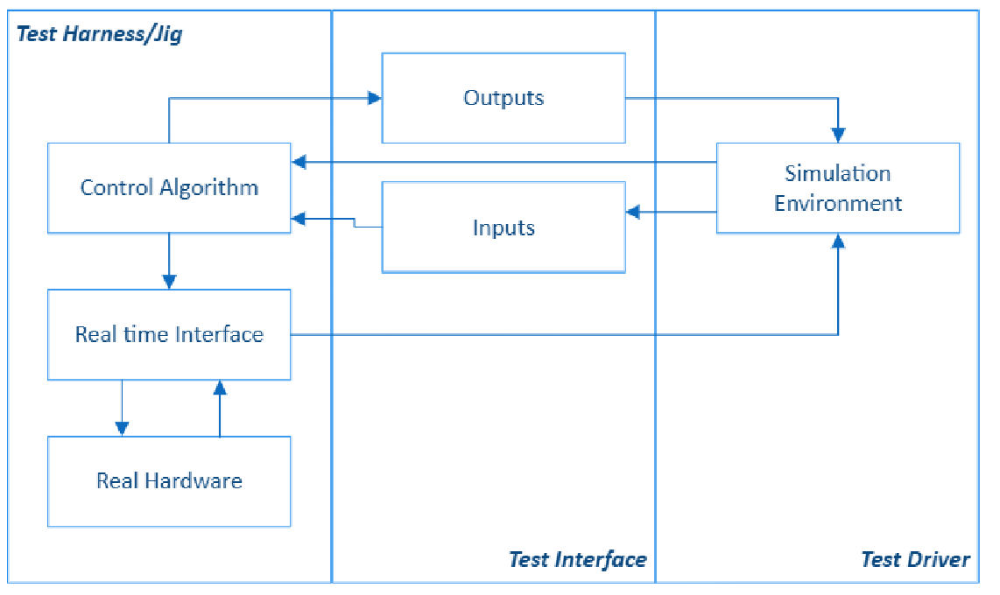
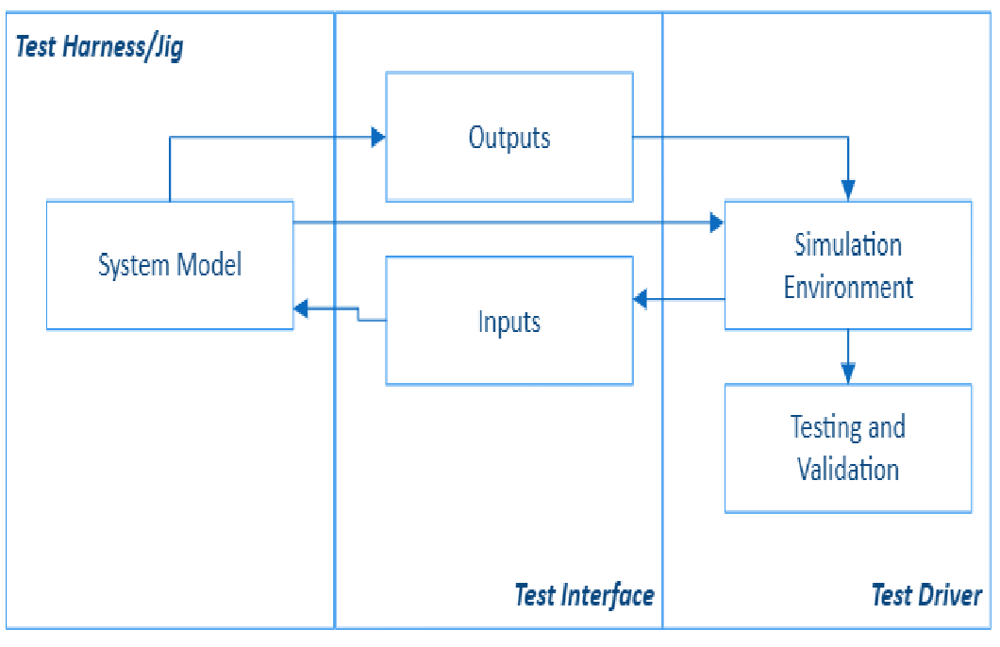
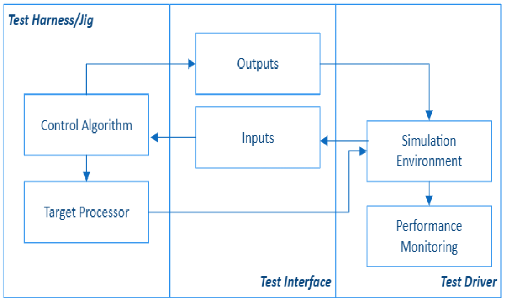
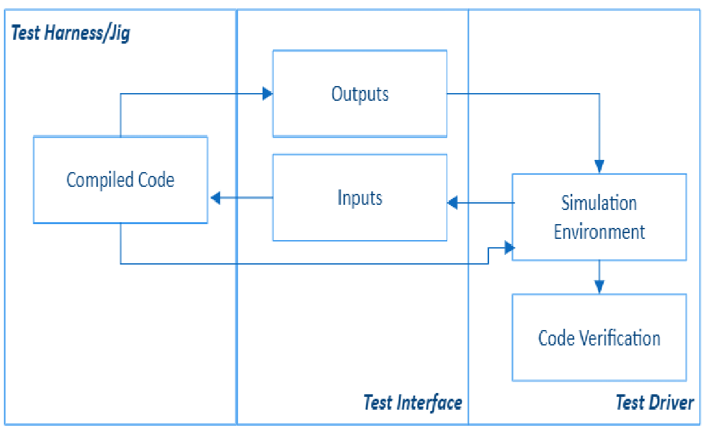
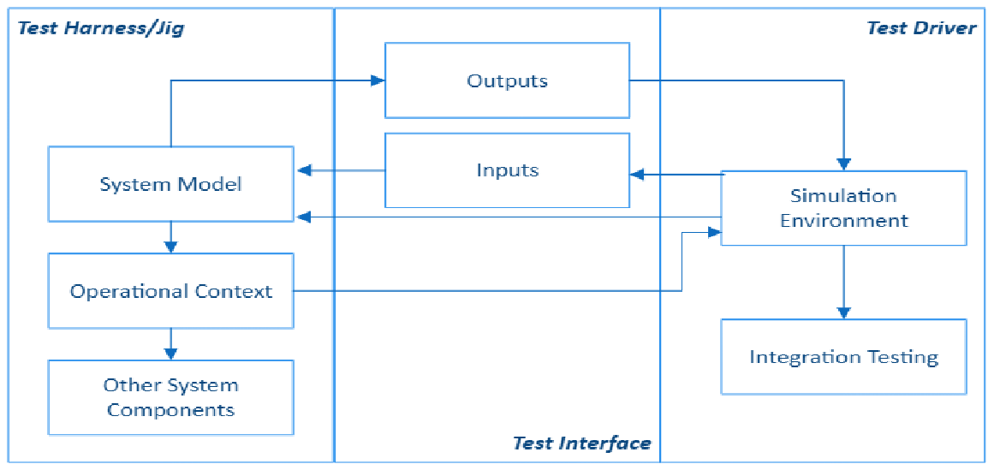
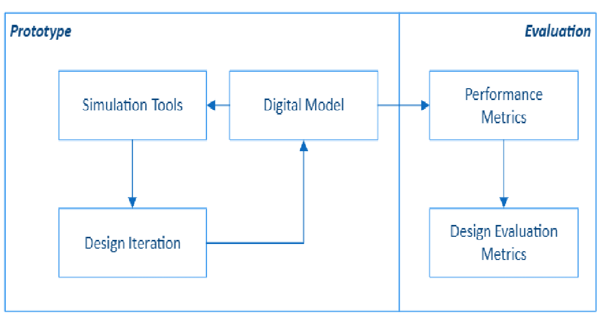

# Loop testing and validation testing
## Approaches to verification and validation engineering

When we break a system down into it's simplest components, we can almost always end up with a model that looks a little like:

> Input -> Software -> Output

This is the a vast oversimplification of most systems, but helps us to understand the basic concepts of testing - verification of behaviour when something happens in the system. This behaviour happens in a loop, where we add/change input, observe, record results, add/change input, observe, etc.  

To deal with the next level of abstraction (moving higher abstraction from the lowest point above) of this loop, we can start modelling some of these systems and test methods in a set of system approaches. These approaches give us the "where" in the system we will apply the test loop (input, observe, record). 

Think of it as the testers positioning themselves within the system - imagine a beach scene. While we're all technically "at the beach", we can all be experiencing the beach in different ways. 

- Some of us can be on the sand, reading a book
- Some of us can be sitting in the car, watching the waves roll in
- Some of us are out there in the water, splashing around

Each of these approaches entail a different level of interference in the system as well as affecting our experience. The person in the car has no affect on the beach, but also has no idea of the water temperature, etc.

This is a general list of concepts around how we can implement system loop approaches in our testing and better understand some of the limitations and advantages of each.

Which one to use (multiple may apply in some situations) will depend on:

- readiness/availability of components
- level of testing
- goals of testing

If the system under test is ready to use and begin integrating with other components in the system then a different approach would be taken than if we were testing or validating a component that was newly developed.

### Hardware in the Loop - (HiL)
{: width="200" height="100" .left}

**Overview:**
- HiL integrates real hardware components into the simulation loop, allowing for testing of the control system with actual hardware.
- It is a crucial step in validating the interaction between software and hardware components.

**Components:**
- **Control Algorithm**: The logic or code that controls the system.
- **Real Hardware**: Physical components such as sensors and actuators involved in the system.
- **Real-Time Interface**: Facilitates communication between the simulation environment and real hardware.
- **Simulation Environment**: Provides a controlled setting for testing hardware-software interactions.

**Purpose:**
- To validate the control algorithms with real-world inputs and outputs.
- To identify integration issues between hardware and software components.

**When to Use:**
- **Pre-Deployment Testing**: HiL is used after the software has been verified to test the interaction between software and hardware components.
- **Integration Testing**: When you need to validate the performance of control algorithms with real-world inputs and outputs.

**Goals:**
- Ensure that the software and hardware components work together seamlessly.
- Identify and address integration issues before full system deployment.
- Test the system's response to real-world conditions and scenarios.

### Model in the Loop - (MiL)
{: width="200" height="100" .right}

**Overview:**
- MiL involves testing the system model or control algorithms within a simulation environment.
- It is an early-stage validation technique used to verify the logic and behavior of the model before any physical components are involved.

**Components:**
- **System Model**: Represents the control logic or system behavior that needs to be tested.
- **Simulation Environment**: Provides a virtual setting where the model can be executed and evaluated.
- **Inputs and Outputs**: Simulated inputs are fed into the model, and outputs are generated, allowing for analysis of system behavior.
- **Testing and Validation**: The model's performance and adherence to requirements are assessed.

**Purpose:**
- To ensure that the model correctly implements system requirements.
- To identify and correct errors early in the development process.

**When to Use:**
- **Early Development Stages**: MiL is used early in the development process when the focus is on validating the control logic and system behavior.
- **Concept Validation**: When you need to ensure that the system model meets the initial design requirements and behaves as expected.
- **Rapid Prototyping**: Useful for quickly iterating on design ideas without the need for physical hardware.

**Goals:**
- Validate the correctness of the control algorithms.
- Identify and fix logical errors in the model.
- Ensure that system requirements are accurately represented in the model.

### Processor in the Loop - (PiL)
{: width="200" height="100" .left}

**Overview:**
- PiL involves running the control algorithms on the actual target processor or an equivalent processor within a simulated environment.
- It focuses on validating the performance of the software on the target hardware platform.

**Components:**
- **Control Algorithm**: The software code that needs to be tested.
- **Target Processor**: The actual or equivalent processor where the code is executed.
- **Simulation Environment**: Provides a platform for testing processor-specific performance.
- **Performance Monitoring**: Evaluates real-time performance, timing constraints, and resource usage.

**Purpose:**
- To ensure that the software meets timing and performance requirements on the target hardware.
- To detect processor-specific issues early in the development process.

**When to Use:**
- **Target Hardware Testing**: PiL is used when you need to validate the software's performance on the actual target processor or an equivalent processor.
- **Real-Time Performance Evaluation**: When you need to assess timing constraints and resource usage on the target hardware.

**Goals:**
- Ensure that the software meets real-time performance requirements.
- Detect processor-specific issues early in the development process.
- Optimize software for the target hardware platform.

### Software in the Loop - (SiL)
{: width="200" height="100" .right}

**Overview:**
- SiL involves running the compiled code of the control algorithms within a simulation environment.
- It bridges the gap between model validation and code verification, ensuring that the software implementation matches the design.

**Components:**
- **Compiled Code**: The actual software code derived from the system model.
- **Simulation Environment**: A virtual platform where the compiled code is executed.
- **Inputs and Outputs**: Simulated inputs are processed by the code, and outputs are analyzed.
- **Code Verification**: Ensures that the compiled code behaves as expected and aligns with the model specifications.

**Purpose:**
- To detect discrepancies between the model and the software implementation.
- To verify the correctness of the software code before hardware integration.

**When to Use:**
- **Post-Model Development**: After the system model has been validated, SiL is used to verify that the compiled software code behaves as intended.
- **Code Verification**: When you need to ensure that the software implementation matches the model specifications before hardware integration.

**Goals:**
- Detect discrepancies between the model and the software code.
- Verify the correctness of the software implementation.
- Prepare the software for integration with hardware components.

### System in the Loop - (SysiL)
{: width="200" height="100" .left}

**Overview:**
- SiL extends MiL by integrating the system model with its operational context, including interactions with other system components or external systems.
- It provides a more realistic and comprehensive validation environment.

**Components:**
- **System Model**: Represents the entire system or control logic.
- **Operational Context**: Includes other system components and external systems interacting with the model.
- **Simulation Environment**: Facilitates testing of system interactions and dependencies.
- **Integration Testing**: Assesses the system's performance and behavior in a realistic setting.

**Purpose:**
- To validate the system's interactions and dependencies with other components.
- To ensure correct system behavior under real-time constraints and operational conditions.

**When to Use:**
- **System Integration**: SiL is used when the system model needs to be tested in its operational context, including interactions with other systems or components.
- **Comprehensive Validation**: When you need to validate the entire system's behavior under realistic conditions.

**Goals:**
- Ensure correct system behavior in a realistic and integrated environment.
- Validate system interactions and dependencies with other components.
- Test the system under real-time constraints and operational conditions.

### Virtual Prototyping - (VP)
{: width="200" height="100" .right}

**Overview:**
- Virtual prototyping involves creating a digital model of the entire system or product to simulate its behavior and performance.
- It is used to evaluate design alternatives and optimize system performance before physical prototypes are built.

**Components:**
- **Digital Model**: Represents the entire system or product in a virtual format.
- **Simulation Tools**: Various tools used to simulate different aspects of the system (e.g., CAD, FEA).
- **Design Iteration**: Continuous cycle of testing and improving the design.
- **Performance Metrics and Design Evaluation**: Criteria used to assess the system's performance and functionality.

**Purpose:**
- To explore design alternatives and identify potential design flaws early in the development process.
- To optimize system performance and functionality before committing to physical prototypes.

**When to Use:**
- **Design Exploration**: Virtual prototyping is used throughout the design process to explore different design alternatives and optimize system performance.
- **Pre-Physical Prototyping**: When you want to evaluate the system's design and functionality before committing to physical prototypes.

**Goals:**
- Identify potential design flaws early in the development process.
- Optimize system performance and functionality.
- Reduce the need for costly physical prototypes by evaluating designs virtually.

## Concluding remarks
These concepts collectively form a comprehensive framework of understanding for validating and verifying complex systems throughout the development lifecycle. They help ensure that systems are designed, implemented, and tested effectively, reducing the risk of errors and improving overall quality and performance.
